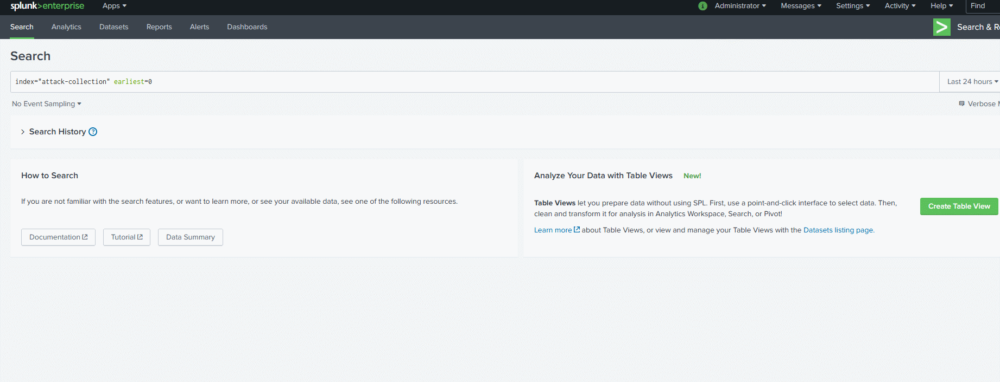

# Analyst Toolbox
  

Analyst Toolbox is a browser extension that enriches your SIEM data without the need for back-end modifications. It provides an Analyst 🧠 context and a deeper insight into the fields they are seeing; such as Public vs. Private IP Space 🌍, Domain Name Whois 💬, MAC Address OUI 💻, and much more.

The goal is to enrich data 🎓 from SIEMs by making OSINT information available at a glance 💡; instead of having to Google it or open more tabs. It locates IP Addresses and Domain Names in a webpage or application- e.g. Splunk, Kibana, etc- and places a tag next to them. Clicking the tag opens a modal 🌱 with additional information and resources relating to that indicator.

It's current in a 🚧 prototyping 🚧 stage, but if you are interested throw a star ⭐ at my project over on DevForce.


# Demo 💥




# Directory Structure 📁
```
├── src
│   ├─ css
│   │  └─ osint-analyst.css
│   └─ js
│      └─ osint-analyst.js
├── dist
│
├── tests
│
├── platform
│
├── tools
│
└── docs
```


# Build Requirements 🛠️
```
choco install make
cd PROJECT_DIRECTORY
make build
```


# Documentation 📝


# TODO 📌
- [ ] Toggle extension ON/OFF.
- [ ] ~~Handle DOM changes.~~
- [ ] IPv[4|6] Tools
  - [ ] IPv4 CIDR Calculator
  - [ ] Ping
  - [ ] Reverse IP(PTR) => https://bit.ly/3q1PfxY
- [ ]Domain tools


# Issues Issues 💦
